# AI Doomsday Toolbox

**An offline AI toolbox for Android that turns one phone, or a cluster of old phones, into a local AI workstation.**

Access our new wiki and read all about the app https://adt.manube.org/

Run local LLMs, Whisper transcription, image generation, distributed inference, dataset creation, offline knowledge tools, and AI-powered utilities directly on Android. The project is built for people who care about privacy, edge AI, on-device AI, distributed compute, and squeezing useful work out of old phones instead of leaving them in a drawer.

Read the web guide at [adt.manube.org](https://adt.manube.org/) for the page-by-page walkthrough.

[](https://developer.android.com)
[](https://developer.android.com)
[](LICENSE)

<p align="center">
  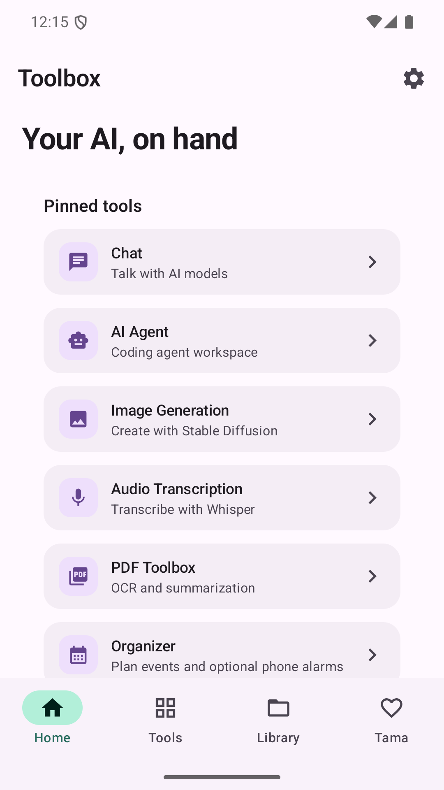
  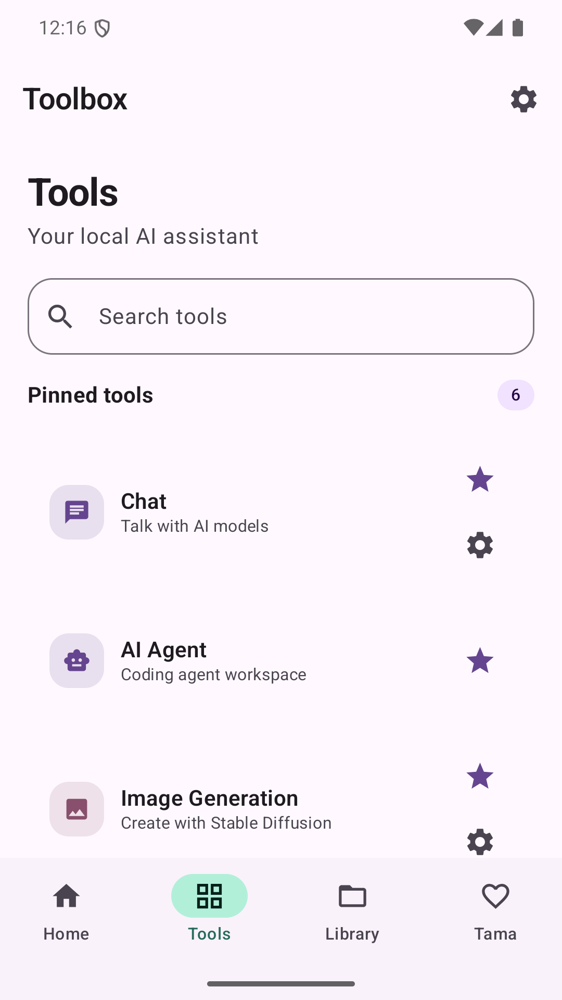
  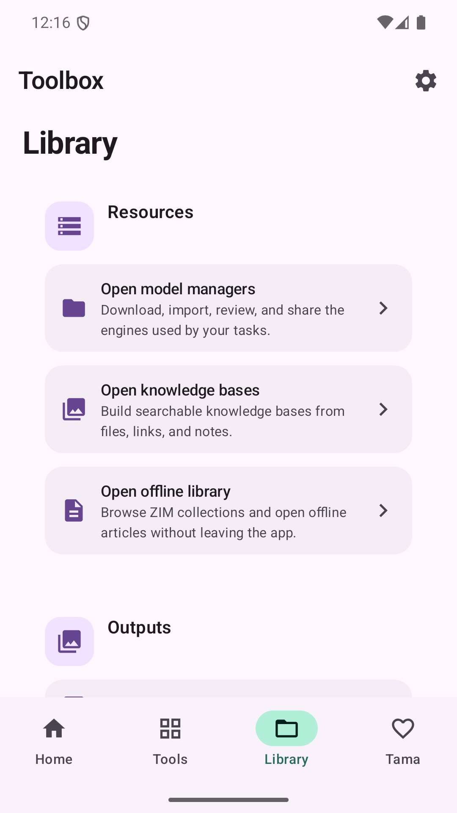
</p>


## Why It's Different

Most Android AI apps focus on one feature. AI Doomsday Toolbox goes further: it combines offline AI on Android with distributed inference, phone-to-phone model sharing, and workflows that can reuse old phones as a low-cost Android cluster or pocket edge-compute setup.

If you are searching for a local LLM on Android, image generation, AI agents to build your projects, offline AI assistant, mobile HPC experiment, phone cluster, Android distributed compute app, or a way to reuse old phones for edge AI workloads, this project is built in that direction.

## Highlights

- Offline AI on Android with local LLM, Whisper, image and video generation, upscaling, and media tools
- Material 3 interface with Home, Tools, Library, and Tama navigation, phone and tablet layouts, and English and Spanish support
- Guided tours with real controls, screenshots, and feature-by-feature recipes that you can skip, resume, or replay
- Custom model downloads, full Hugging Face repository browsing, saved links, and your own model bundles
- Distributed inference features for coordinating multiple Android devices on the same network
- Built-in Ollama manager, llama native chat, and remote summary tools
- Dataset creator that turns text and PDFs into cleaned, rated instruction-answer pairs with Alpaca export
- Termux + proot tool environment with install helpers, SSH workflows, in-app webview access, and file management
- AI agent workspace with custom tools, custom agents, and project memory
- Tama virtual pet systems with adventures, farming, chat, and persistent memories
- Android share-intent support for PDFs, videos, images, and audio files

## Guide Index

- [Dashboard](#dashboard): Home, pinned tools, recent work, device and server status
- [AI HUB](#ai-hub): Tools, AI Servers, studios, workflows, datasets, native chat, agent tools
- [Library](#library): models, knowledge bases, offline content, image and video galleries
- [Models](#models): model families, custom downloads, saved links, repository browsing, bundles, sharing
- [Settings](#settings): runtime controls, backups, restore, prompts, output paths
- [Organizer](#organizer): notes, calendar, alarms, widgets
- [P.E.T.](#pet): pet systems, chat, gallery, farm, adventures

## Pages From The Web Guide

### Dashboard

- The Dashboard is now Home, with pinned tools, recent conversations and projects, and compact device and server status.
- The bottom navigation connects Home, Tools, Library, and Tama, with a navigation rail on larger layouts and a menu on compact or large-text layouts.
- The Explore button beside Settings opens the app tour, with options to start, resume, replay, or choose a chapter.
- The file server browser can now receive uploads from connected devices too, including whole folders that stay grouped under the selected folder name, plus progress, speed, and remaining-time feedback behind a compact `+` upload picker.

### AI HUB

- The AI HUB is now the Tools catalog, grouping the main AI work surfaces by task with search and pin controls.
- It groups AI Servers, image and video generation, ONNX image generation, background removal, text to speech, audio transcription, subtitle and translation workflows, PDF tools, video summary, benchmark, dataset creation, training, Termux SSH tools, the AI agent workspace, Ollama Manager, and native llama chat.
- The browser-facing AI Servers Hub also maps Image Studio, Video Studio, Workflows, Voice Studio, Video Upscale, Docs and Datasets, and Llama Chat into local web UIs with QR and LAN access controls.

### Library

- The Library brings together models, knowledge bases, offline content, and saved output collections.
- Open the image and video galleries directly without going through the generation form.
- Keep reading, manage local resources, and return to saved work from one root page.

### Models

- The Models area is split by model family so you can manage LLM, Stable Diffusion, ONNX, LiteRT, Whisper, and shared model workflows separately.
- The model screens cover installed items, downloads, discovery, import, export, rename, and sharing flows, with installed counts and occupied storage.
- Paste a Hugging Face file link or direct HTTPS link into Custom download, or use the folder button to browse a complete Hugging Face repository.
- Keep download sources in Saved links and create separate bundles for LLM, Stable Diffusion, ONNX, LiteRT, and Whisper.
- Files that cannot be confidently identified stay in Unknown until you choose their family and component type.
- The LLM-side model flow also includes vision-projector handling for compatible setups.

### Settings

- The Settings area covers general app behavior, LLM runtime controls, image generation settings, Whisper settings, video upscaler settings, and system prompts.
- It also contains the backup and restore flows, including full app backup and the native chat plus Organizer ZIP transfer flow.
- Full app backup includes portable saved sources and bundle definitions so you can download missing models after moving devices.
- Choose system, light, or dark appearance, optional wallpaper colors, and English or Spanish.
- It includes output-folder, acceleration, thread-count, and saved-prompt controls, plus a permanent entry for managing llama.cpp servers.

### Organizer

- The Organizer groups notes, calendar events, alarms, and their widget surfaces.
- It also connects with the native chat tooling and the ZIP transfer flow described in Settings.

### P.E.T.

- P.E.T. is the app's Tamagotchi-like subsystem with its own home screen, chat, gallery, farm, store, and adventure systems.
- The broader P.E.T. area includes dream recaps, artwork/gallery flows, room and decoration systems, and Adventure Gate.
- It also connects with the app's local AI backends and long-term saved state.

## Features

### App Navigation And Guided Tours

- Keep pinned tools and recent work on Home
- Search the Tools catalog by task and open models, knowledge, offline content, and galleries from Library
- Use the same Material 3 interface on phones and tablets, with layouts that adapt to screen size and text size
- Follow the automatic first-use tour after setup, or replay it from the Explore button on Home
- Open the Explore button inside each feature for practical quick starts, common options, and screenshot examples
- Choose from 26 guides and 89 recipes, with Previous, Next, Skip, Resume, Replay, and an always-available X
- Complete the explanations without downloading models, granting permissions, creating data, or starting inference

<p align="center">
  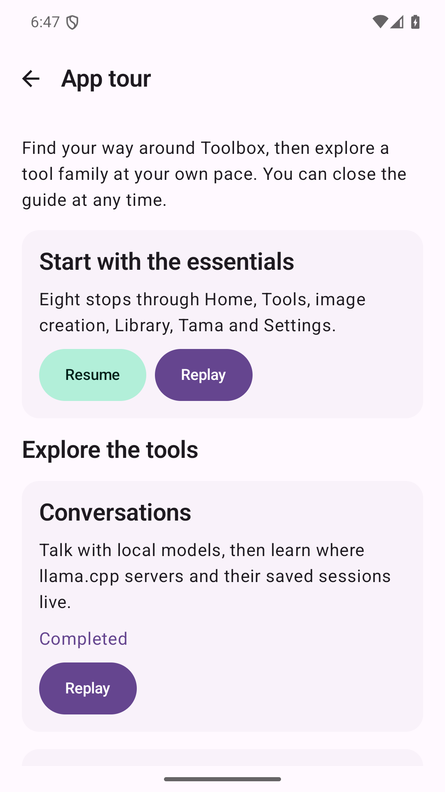
  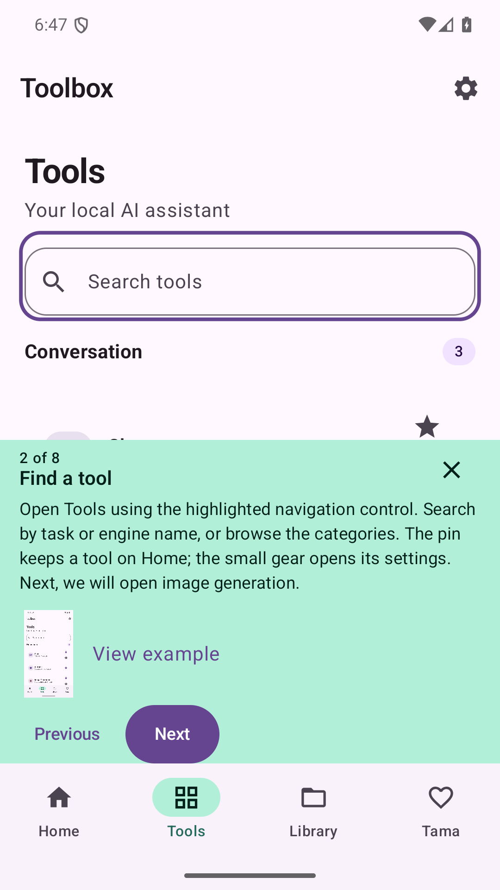
  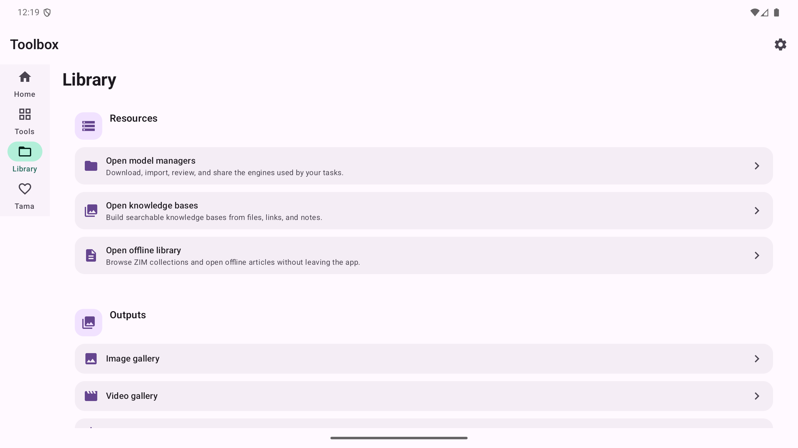
</p>

### Distributed Inference And Android Cluster Workflows

- Run distributed inference features across multiple Android devices
- Experiment with turning old phones into a low-cost phone cluster for local AI workloads
- Monitor worker/master flows from inside the app
- Read device names, endpoints, connection states, RAM, allocation, and load in responsive network cards
- Keep Worker memory status current with a shared two-second sample that runs off the UI thread
- Share models and services over the local network for offline collaboration
<p align="center">
  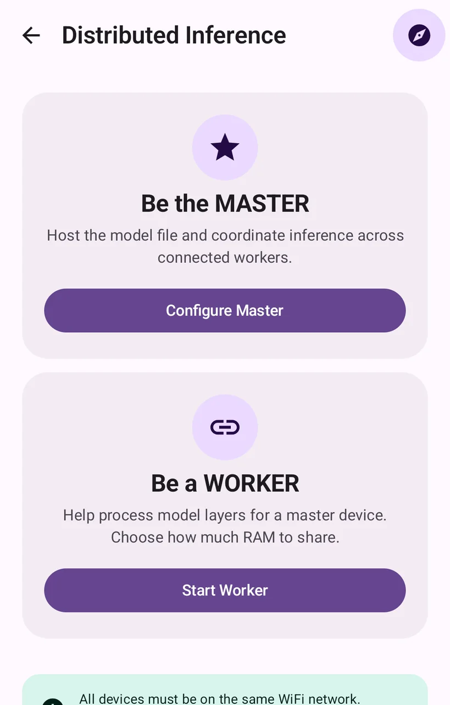
</p>


### Local AI Chat

- Chat with local LLMs on Android
- Support GGUF-based llama.cpp workflows
- Connect to llama.cpp-compatible servers and llama-server backends through a native in-app chat UI
- OpenAI-compatible local server mode on port `8080`
- Multiple model support with switching from the app interface
- Create, start, and stop llama.cpp servers from the server manager even while chat is available
- Choose between running servers from inside chat when more than one is active
- Schedule tasks and review their next run and logs from the built-in scheduler
- Optional LAN-visible server behavior through settings when needed
- Use Ollama-compatible workflows where they fit best for your setup
- Keep inference on-device or on your own local network instead of relying on cloud chat

<p align="center">
  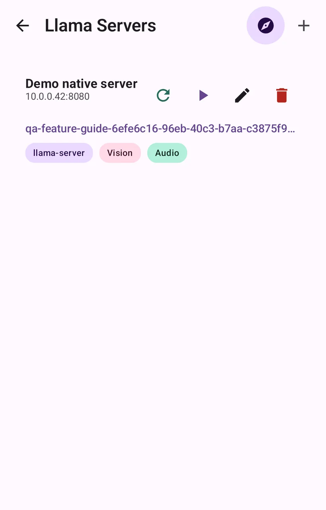
  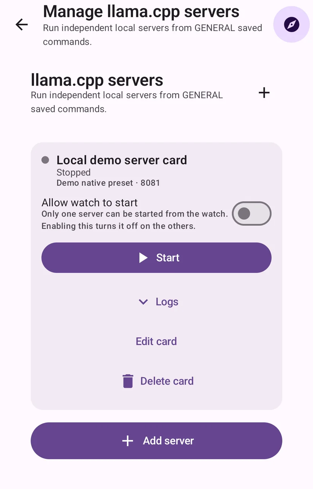
  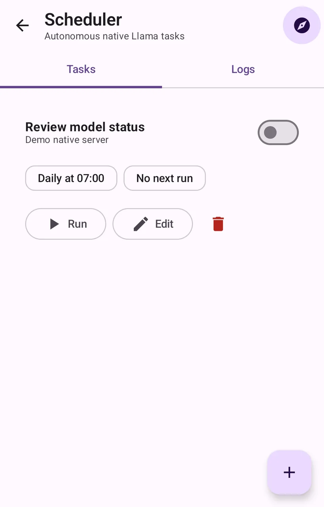
</p>

### Ollama Manager

- Add and manage Ollama servers from inside the app
- Pull, inspect, copy, delete, and organize models
- View and edit Modelfiles
- Create derived models without leaving the Android interface

<p align="center">
  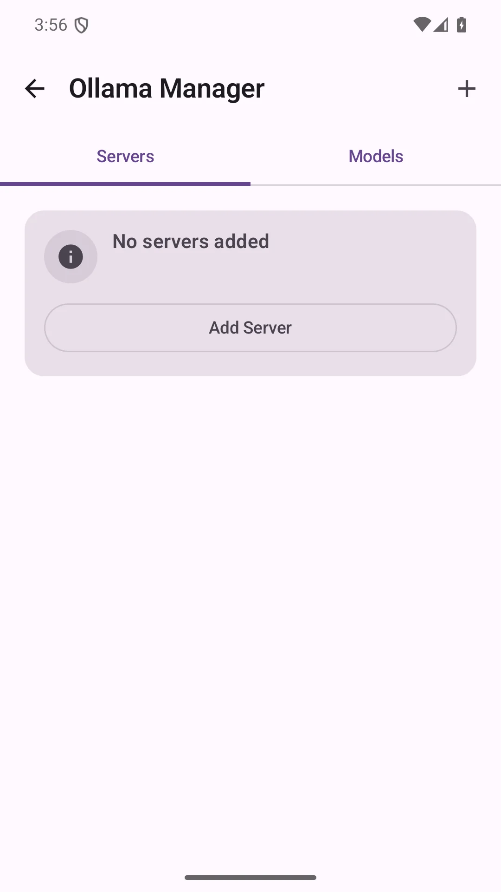
</p>

### Benchmarking

- Benchmark your device for LLM workloads
- Compare thread counts to find the best number of threads for a specific model
- Save benchmark results for later reference
- Use real llama benchmarking output instead of guessing performance

<p align="center">
  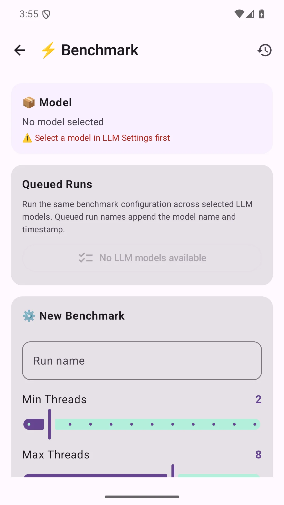
</p>

### Dataset Creator

- Import `.txt` and PDF files
- Split source material into chunks for cleaner processing
- Clean chunks before question generation
- Generate five questions per chunk using neighboring chunk context for better continuity
- Generate answers, rate the pairs, and export the best entries
- Export in Alpaca JSON format
- Customize the prompts used for cleaning, question generation, answer generation, and review


### Termux Tools And Ubuntu SSH Workflows

- Connect to the Ubuntu SSH server from inside the app, with host, port, username, and password entered manually
- Follow the in-app setup help for installing `proot-distro`, provisioning Ubuntu, and enabling `sshd` inside Ubuntu on the default app port `8025`
- Install predefined tools such as Ollama, Open WebUI, Big-AGI, Oobabooga text-generation-webui, FastSDCPU, and experimental A1111 workflows with one in-app installer button per tool or the new `Install all` flow
- Open compatible tools in an in-app webview
- Manage remote files with the built-in Termux file manager
- Optionally expose each service outside `localhost` when your workflow needs LAN access
- See the fixed service port directly in the tool cards, and when LAN mode is enabled the cards also show the detected Ubuntu LAN `host:port` target for connecting outside the app

**Note:** The Termux tool installers now clone the maintained ManuXD32 forks for Big-AGI (`v2-dev`), FastSDCPU, Oobabooga/textgen, and A1111 to reduce upstream breakage. FastSDCPU installation also prepares the shared MCP runtime, so MCP no longer needs its own separate install step. A1111 / AUTOMATIC1111 support is still experimental, but the current Ubuntu installer now uses Python 3.11, mirrored Stable Diffusion dependencies, clip import verification/repair, and disables the default SD 1.5 auto-download / repeated environment prep on first launch.

<p align="center">
  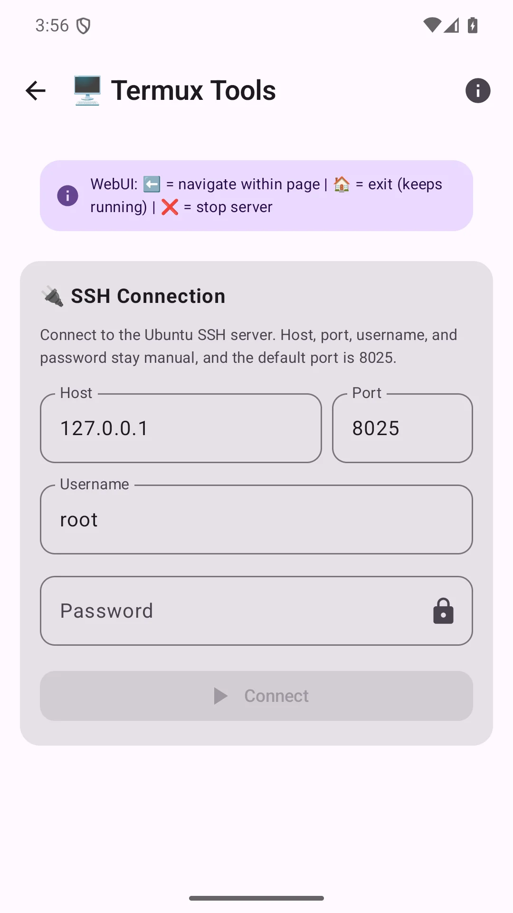
</p>


### AI Agent Workspace

- Run an AI coding/workflow agent environment powered by Termux and Ollama-compatible backends
- Create custom tools and custom agents
- Keep project-specific workspace memory and task context
- Build reusable automation flows around your own projects
- Review plans in a full-screen editor, inspect approvals, and use Continue to recover interrupted work
- Return to the previous app page with Back while keeping saved conversations and running work

<p align="center">
  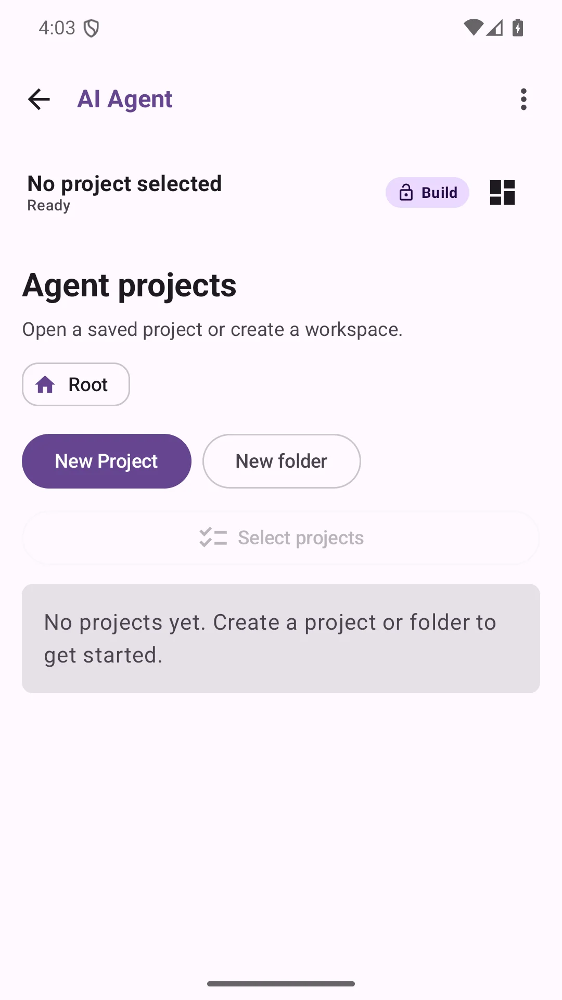
</p>


### PDF, Video, And Summary Tools

- Extract text from PDFs with OCR fallback when needed
- Summarize PDFs, videos, and transcription workflows
- Use Ollama and/or llama.cpp-compatible remote backends for summary generation
- Tune prompts, context limits, output length, and related summary parameters per workflow

<p align="center">
  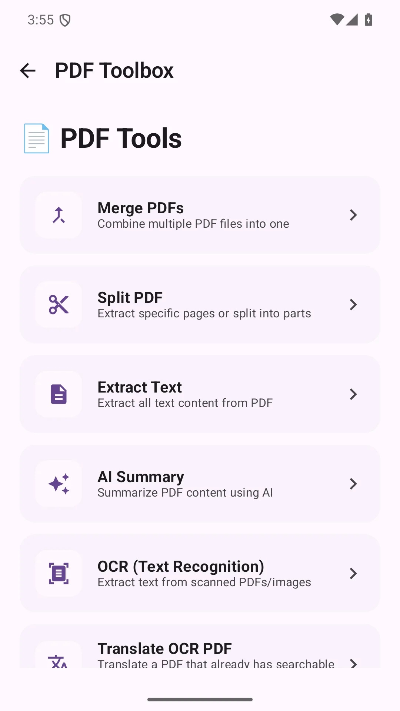
  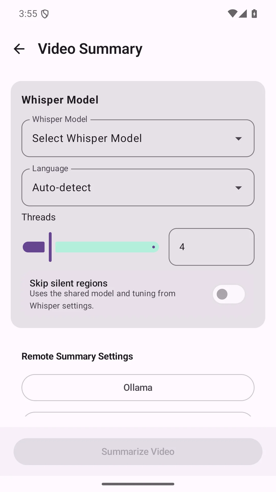
</p>


### Audio, Video, And Subtitle Tools

- Transcribe audio and video with Whisper
- Support multiple languages and model sizes from lightweight to larger accuracy-focused options
- Summarize video content after transcription
- Extract audio from videos with FFmpeg as part of summarization/transcription workflows
- Burn subtitles into video with styling controls such as font, color, and position
- Process media directly from Android share intents


### Model Downloads, Saved Links, And Bundles

- Manage LLM, Stable Diffusion, ONNX, LiteRT, and Whisper models in separate screens
- See complete Stable Diffusion filenames, installed counts, and actual occupied storage
- Paste a Hugging Face file link or direct HTTPS link and download after automatic link validation
- Use the folder button beside the existing `+` to browse complete Hugging Face repositories, including nested folders and unfamiliar files
- Keep downloads resumable, with progress, cancellation, retry, and available-space checks
- Leave uncertain files in Unknown and use the Component type picker when you need to classify them manually
- Save or edit a model's download source without changing its installed file
- Create your own bundles from installed models and saved links, including compatible encoders, VAEs, LoRAs, projectors, and companion files
- Use Download missing to restore a ready bundle while skipping verified installed files
- Keep saved links and bundle definitions after deleting models, and transfer them through full app backup

<p align="center">
  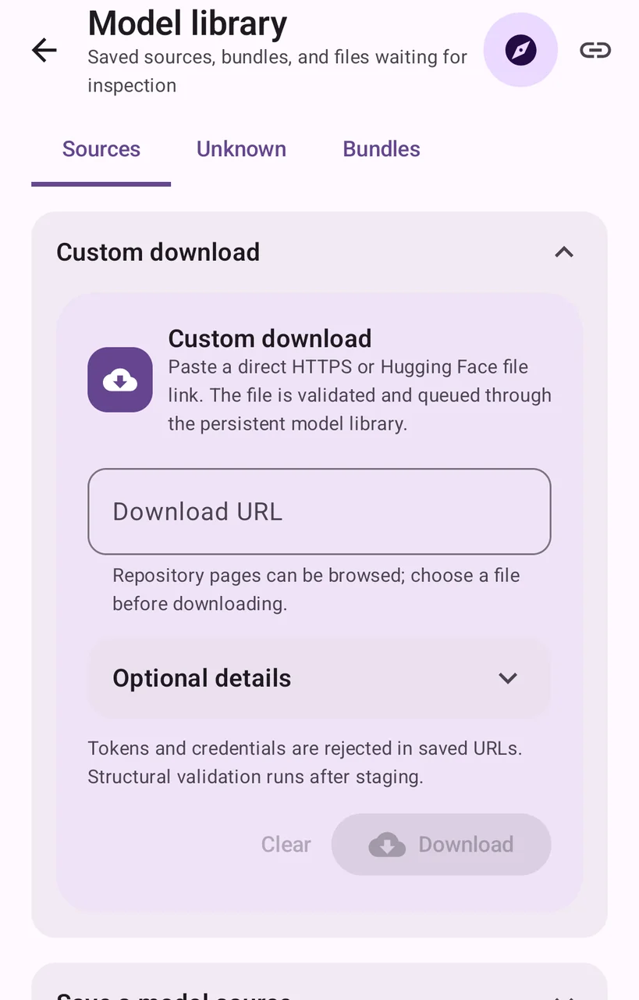
  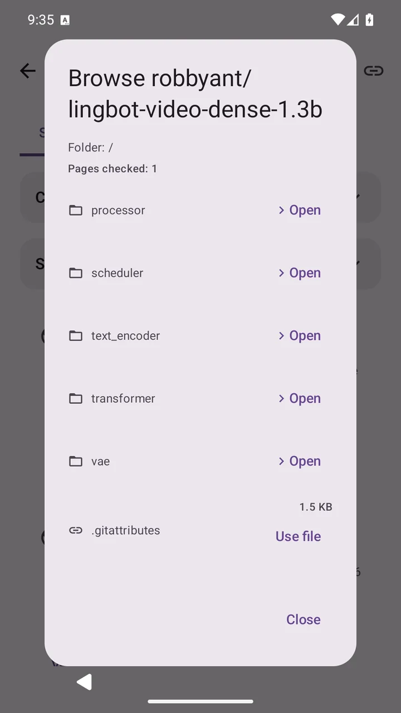
  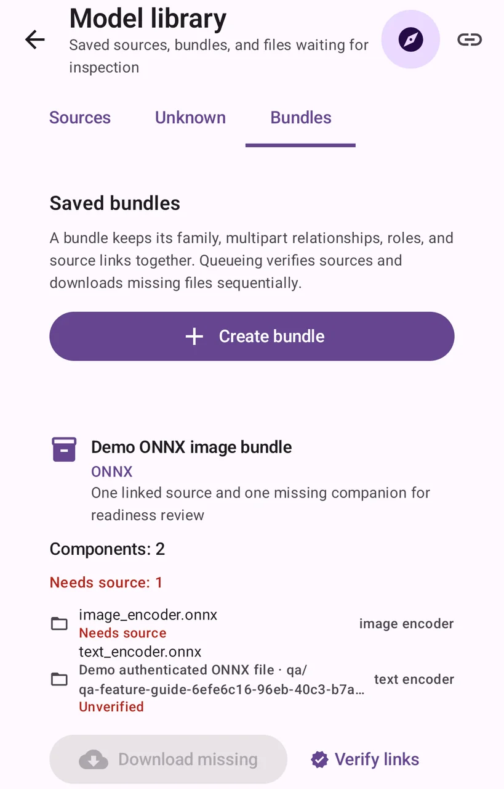
</p>

### Image And Video Generation

- Generate images with Stable Diffusion workflows directly on Android
- Generate local video with supported Wan, HunyuanVideo, LingBot, LTX, MiniMax-H3, and AnimateDiff workflows in the bundled `stable-diffusion.cpp` backend
- Select T5, LLM, or combined text encoders according to the model family, with compatible vision, VAE, audio, and motion components where supported
- Tune prompts, seed, dimensions, frames, frame rate, sampling, reference inputs, caching, tiling, and backend placement
- Add, remove, reorder, enable, and tune LoRAs, including high-noise assignments where supported
- Try the LingBot Dense 1.3B bundle with Qwen3-VL 4B Q4 and `taew2_1`, plus a phone example profile at `256x144`, 9 frames, 4 fps, and 12 steps
- Keep generation and cancellation controls visible while the form scrolls
- Save MP4 output with audio when available, keep supported native formats, and retry conversion without losing usable native output
- Browse the video gallery with prompts, generation settings, sharing, deletion, and copyable result information

**Note:** Video options depend on the selected model family and the flags supported by the selected binary. The LingBot phone profile is an example configuration, not a guarantee that every phone has enough memory or that generation will be fast. SVD models can be inspected, but generation is unavailable in the bundled backend.

### Image Generation And Upscaling

- Generate images with Stable Diffusion workflows directly on Android
- Includes SD 1.5, SD 2.1, SDXL, and FLUX-oriented workflows
- Adjustable generation settings such as steps, CFG scale, dimensions, sampler, seed, tiling, and per-run diffusion caching
- Upscale images and videos with RealESRGAN-based tools
- Multiple scale factors are available depending on the selected model
- Built-in scrollable option guides explain the image and video generation controls and note which features are powered by `stable-diffusion.cpp`
- Use FastSDCPU in Termux/proot workflows for additional image-generation setups
- Experiment with A1111-style web UI workflows through the Termux tools area

<p align="center">
  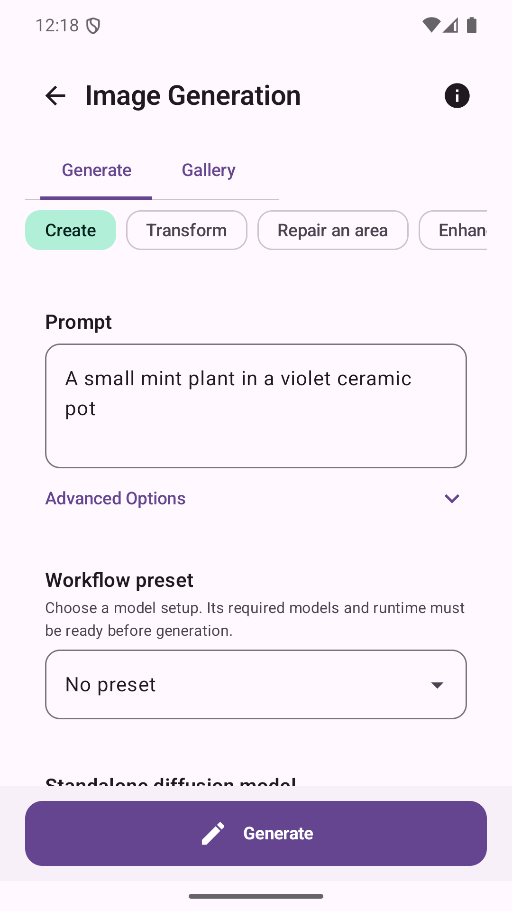
</p>

### Offline Knowledge, Sharing, And Utilities

- Browse offline knowledge bases with Kiwix and ZIM file support
- Download ZIM files through the catalog or import them from internal storage
- Built-in Kiwix server support on port `8888`
- Optional LAN access so other devices on your network can connect to shared content
- Share models and ZIM files over LAN with web UI and QR-based connection flows
- Export shared files to storage when needed
- Create and manage notes with Markdown support
- Automatic note creation for summaries and transcription workflows
- Use Android share intents to send PDFs, videos, images, and audio into the app’s processing flows

### Tama Virtual Pet

- Raise a Tamagotchi-like pet inside the app
- Go on AI-generated adventures
- Work, farm, and interact across multiple gameplay systems
- Talk to your pet and build memories over time
- Discover different personalities and long-term companionship mechanics
- Let your pet dream, paint, and keep growing with you over long play sessions
- Keep the full-height room for your generated scenery and placed decorations
- Open guides from Tama activities and games without resetting your pet or gameplay

<p align="center">
  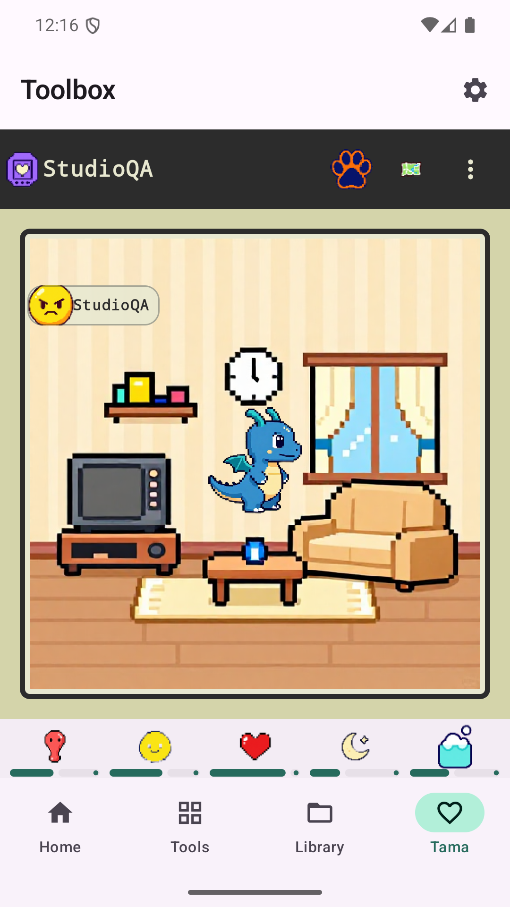
  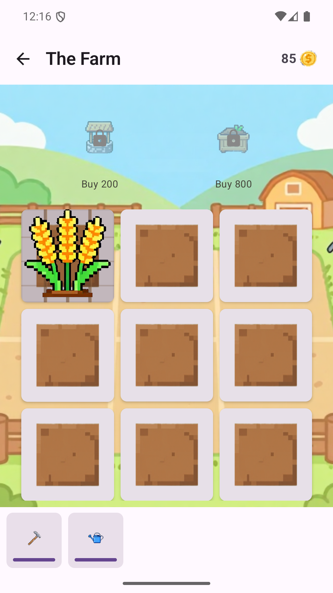
</p>


## Built With

### Core AI And Media Projects

- [llama.cpp](https://github.com/ggerganov/llama.cpp)
- [whisper.cpp](https://github.com/ggerganov/whisper.cpp)
- [stable-diffusion.cpp](https://github.com/leejet/stable-diffusion.cpp)
- [FFmpeg](https://ffmpeg.org)
- [Kiwix-tools](https://github.com/kiwix/kiwix-tools)
- [Real-ESRGAN](https://github.com/xinntao/Real-ESRGAN)

### Compatible And Integrated Tooling

- [Ollama](https://github.com/ollama/ollama)
- [Open WebUI](https://github.com/open-webui/open-webui)
- [Big-AGI](https://github.com/ManuXD32/big-AGI/tree/v2-dev)
- [Oobabooga text-generation-webui](https://github.com/ManuXD32/textgen)
- [FastSDCPU](https://github.com/ManuXD32/fastsdcpu)
- [AUTOMATIC1111 / stable-diffusion-webui](https://github.com/ManuXD32/stable-diffusion-webui)
- [EasyDataset](https://github.com/ConardLi/easy-dataset)
- [Termux](https://github.com/termux)

### Android Stack

- Kotlin with Jetpack Compose and Material 3 for the UI
- Room for local persistence
- NanoHTTPD for embedded local servers
- ZXing for QR code generation
- ML Kit for OCR
- Apache PDFBox for PDF handling

### Architecture

- Native binaries built for `arm64-v8a`
- Foreground services for long-running AI tasks
- Unified notification flows for background processing
- SAF-based file handling for imports and exports

## Getting Started

### Join The Google Play Beta

If you want the easiest install path, you can join the Google Play beta here:

[AI Doomsday Toolbox on Google Play](https://play.google.com/store/apps/details?id=com.manuxd32.aidoomsdaytoolbox)

The Google Play version uses an Android App Bundle, so the installation is usually smaller than downloading a universal package manually. Joining the beta also helps a lot by improving testing coverage, surfacing device-specific issues, and making it easier to validate updates before wider releases.

### Requirements

- Android 8.0+ (API 26)
- `arm64-v8a` device
- More RAM and storage if you plan to run larger local models
- Additional devices on the same network if you want to experiment with distributed inference and phone-cluster workflows

### Build From Source

```bash
git clone https://github.com/ManuXD32/AI-Doomsday-Toolbox.git
cd AI-Doomsday-Toolbox

./gradlew assembleDebug
```

For release bundles, the project expects Java 21 and the usual signing environment variables:

```bash
KEYSTORE_PATH=/absolute/path/to/your-release.keystore \
JAVA_HOME=/usr/lib/jvm/java-21-openjdk \
KEYSTORE_PASSWORD=your_keystore_password \
KEY_PASSWORD=your_key_password \
./gradlew :app:bundleRelease
```

### Models And Content

Models and large offline content are managed separately inside the app. The project includes workflows for downloading, importing, and organizing models and ZIM content based on the feature you want to use. Use Library to find the model managers, Custom download for a file link, or My bundles to save a group of models for later downloads. Local imports work without a download link; bundle entries need working sources before they can be downloaded on another device.

## Contributing

Contributions are welcome. If you want to improve a feature, fix a bug, or help with documentation, pull requests are appreciated.

## Support

If this project helps you, you can support development here:

- [Ko-fi](https://ko-fi.com/L3L61QAJ1S)
- [PayPal](https://paypal.me/ManuelG815)

## Disclaimer

This project is provided as-is, without any guarantee that it will be error-free, fit for a particular purpose, or safe for every workflow. You are responsible for how you use it, including any commands, model workflows, remote connections, generated output, or automation built on top of it.

The author is not responsible for misuse of the app, data loss, device issues, network exposure, third-party tool behavior, or damage caused by incorrect configuration, generated content, or user actions.

## License

This project is licensed under the [Apache License 2.0](LICENSE).

## Author

**ManuXD32** - [GitHub](https://github.com/ManuXD32)
